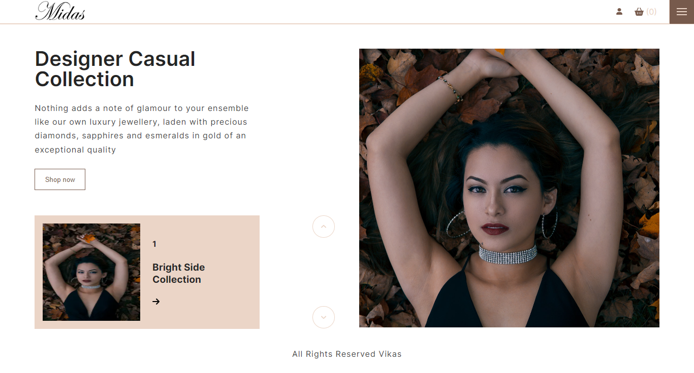

# E-commerce Website

### Tools

- [Next.js](https://nextjs.org/)
- [SASS](https://sass-lang.com/)
- [Firebase](https://firebase.google.com/)
- [Redux](https://redux.js.org/)
- [Stripe](https://stripe.com/)
- [Gsap](https://greensock.com/gsap/)
- [Next Sitemap](https://www.npmjs.com/package/next-sitemap)
- [Next Progressbar](https://www.npmjs.com/package/nextjs-progressbar)
- [React Cookie Consent](https://www.npmjs.com/package/react-cookie-consent)
- [Nodemailer](https://nodemailer.com/)
- [Google Recaptcha](https://www.google.com/recaptcha/)

### Development

A full-stack e-commerce website build using Next.js, SASS for styling and Google Firebase for backend and authentication. A mini API has been created to send emails for contact information. Checkout process can be tested with stripe.
